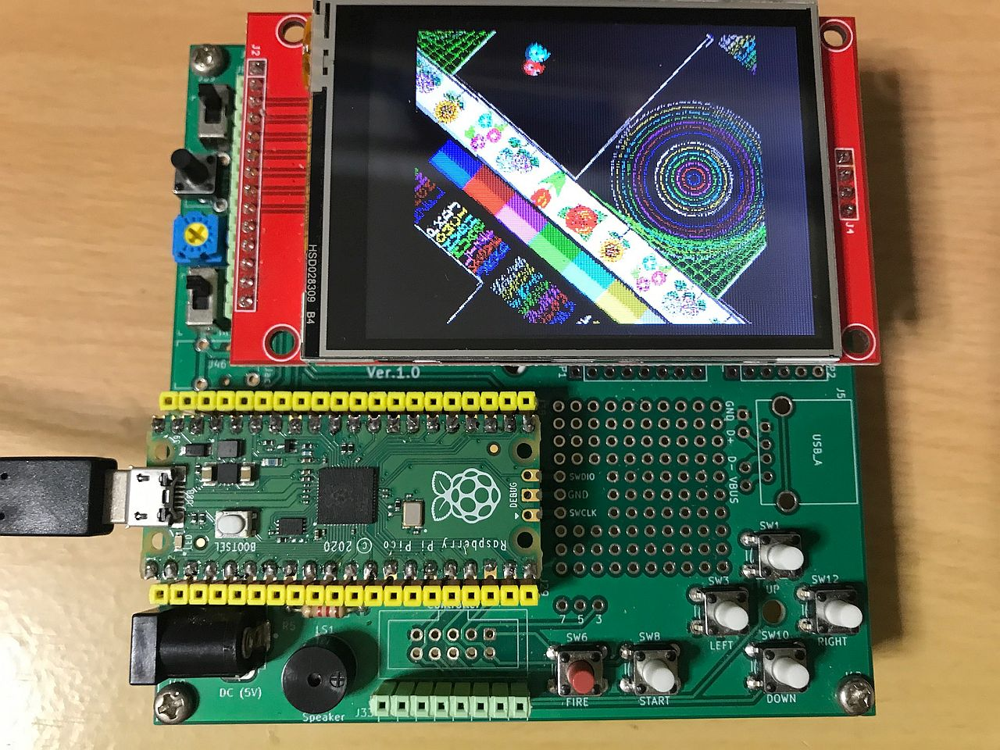
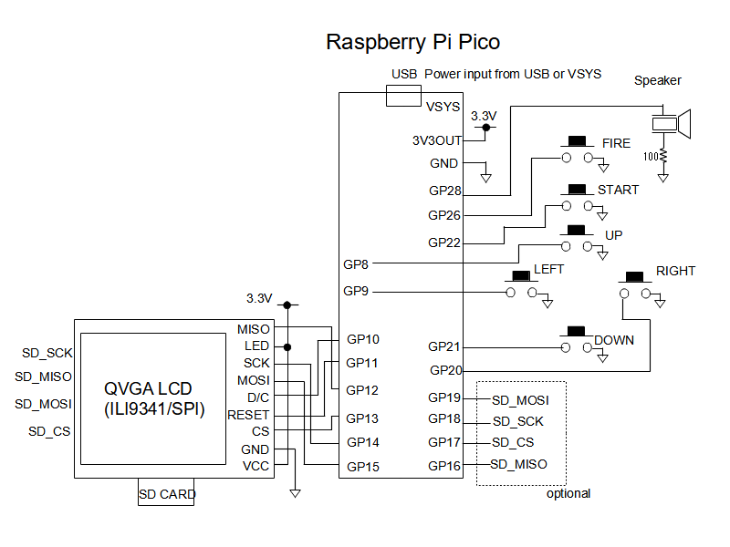

# Raspberry Pi Pico用拡大縮小回転液晶出力ライブラリ
ラズベリーPi Picoで240x320ドット、コントローラにILI9341を搭載したSPI接続の液晶で、画面の拡大縮小回転を実現するライブラリです。  
回路図のボタン、スピーカは特になくても動作します。  
BASICマイコンMachiKania type Pでもそのまま動作させることができます。  

## ソースプログラムのビルド方法
ソースプログラムのビルドにはRP2040に対応したコンパイラの他、CMake、pico-sdkが必要です。  
SDKが使用できる環境設定をした上で、ダウンロードした拡張子が.c .h .txt .cmakeのファイルを同じフォルダに入れてビルドしてください。  
rotatevideo_lcd.cとgraphlib.cがライブラリ本体となります。3種類のデモを用意しており、rotate_demo.cのmain関数でdemo1～demo3を変更してください。  
  
  